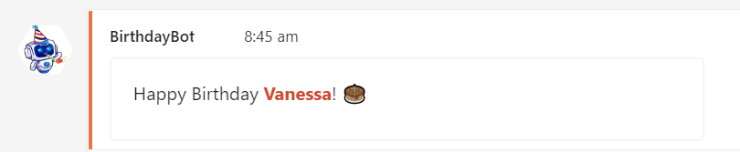

# Microsoft Teams Birthday Bot
This repository contains code that can be used to create a birthday bot that wishes your team mates happy birthday in a Microsoft Teams channel or chat. 



# Set-up and usage
## Requirements
* Python (see requirements.txt for specific libraries requried)
* MS Teams Webhook URL
* Access to an automated scheduling service
* Birthdays and organisation emails of your team mates
### MS Teams Webhook
The birthay bot uses an Incoming Webhook to post to MS Teams. An Incoming Webhook connects a MS Teams channel with external content, where a JSON payload can be sent to the webhook's unique URL. For the BirthdayBot you will need to create an Incoming Webhook and the BirthdayBot will send a JSON payload with a 'Happy Birthday' message to the unique URL provided. Instructions for how to create an Incoming Webhook can be found [here](https://learn.microsoft.com/en-us/microsoftteams/platform/webhooks-and-connectors/how-to/add-incoming-webhook). 
> :warning: Keep your unique webhook URL PRIVATE

You can set up a profile picture for your webhook too, the BirthdayBot profile picture in the screenshot above is included in this repo. 
### Team Birthdays Excel Spreadsheet
All of the birthdays should be stored in the Team Birthdays excel spreadsheet (a template of this file can be found in this repo). The spreadsheet stores the name and birthday of each team member. It should also record the team mate's organisation/company email address so that they can be tagged in their birthday message. 
> :warning: The birthday spreadsheet should not be uploaded to a PUBLIC repository 
## Code set-up
All of the code related to the BirthdayBot is contained in the birthday_bot.py file. You will need to add your webhook URL to the code on line 8. 
```
# Include your unique webhook URL here!
url = '<teams organisation>.webhook.com/xxxxxxx'
```
You can now run the python file, and a post will be made to the Microsoft Teams chat or channel connected to the webhook URL. 

## Scheduling the bot 
Now that you have the webhook and code set up, you need a way to trigger the Birthday Bot automatically every day to make sure that no one's birthday is missed. My BirthdayBot is scheduled for 8.45am every morning. 
### On a local machine 
The easiest way to trigger the BirthdayBot is by using an automated scheduler. Cron (Unix devices) or Task Scheduler (Windows) can be used to set this up. 
### Cloud
For my version of the BirthdayBot, I wanted to make sure it always ran, even when my laptop was off so I decided to host the bot on the cloud. A serverless compute service such as Microsoft's [Azure Functions](https://azure.microsoft.com/en-au/products/functions/) or Amazon's [AWS Lambda](https://aws.amazon.com/lambda/) is a good option for this. For my solution, I also automated the process of collecting birthdays using a Microsoft Form and building a CI/CD pipeline to update the code. 
